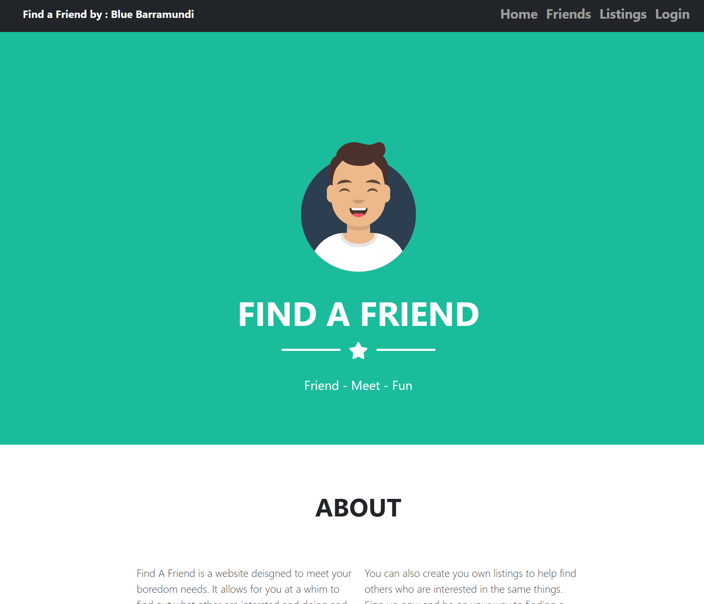
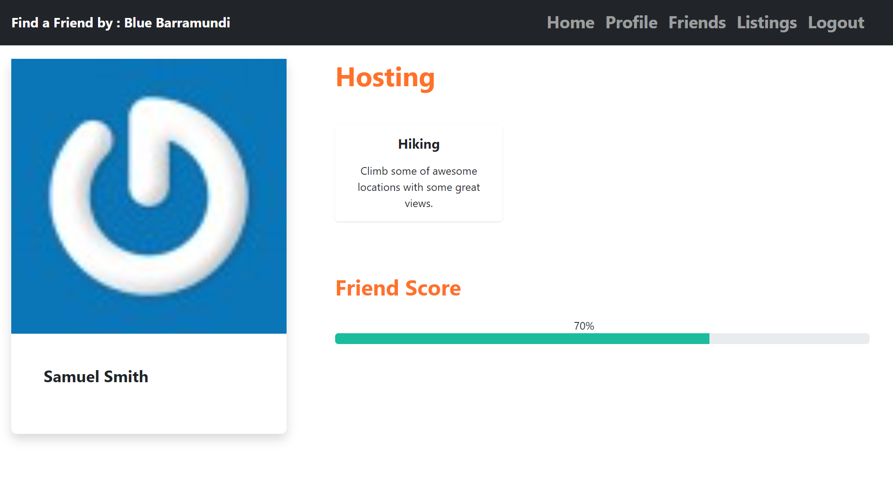
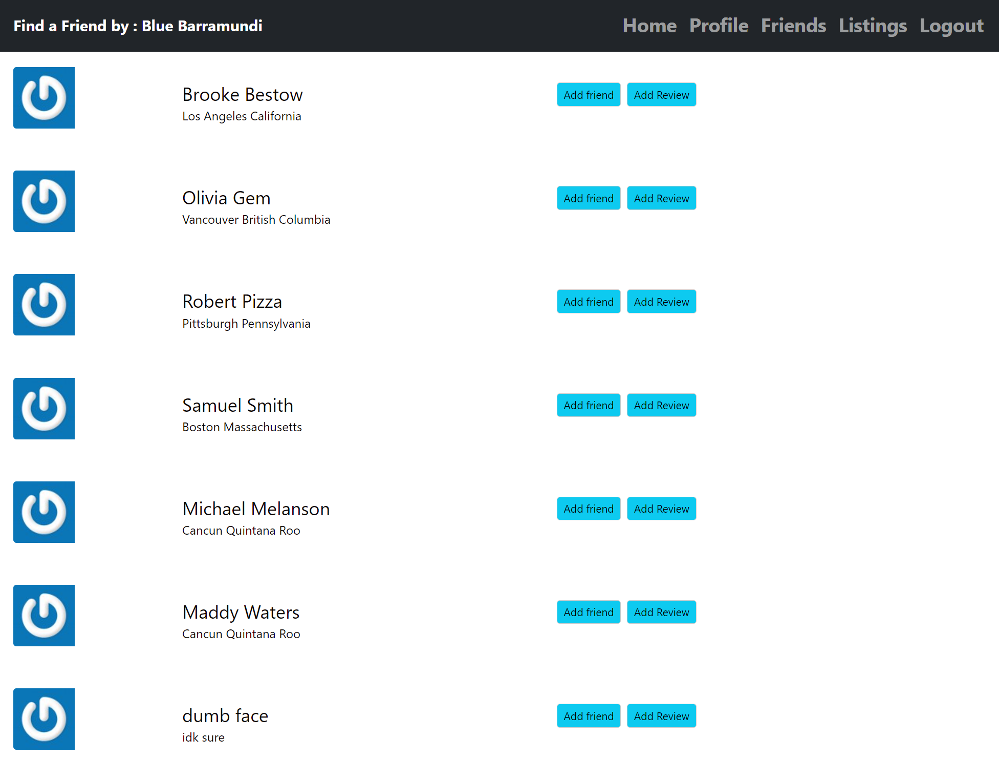
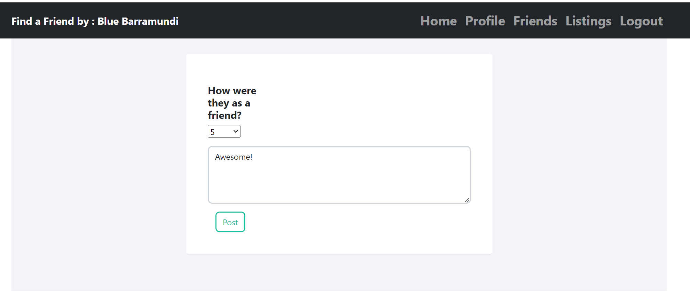
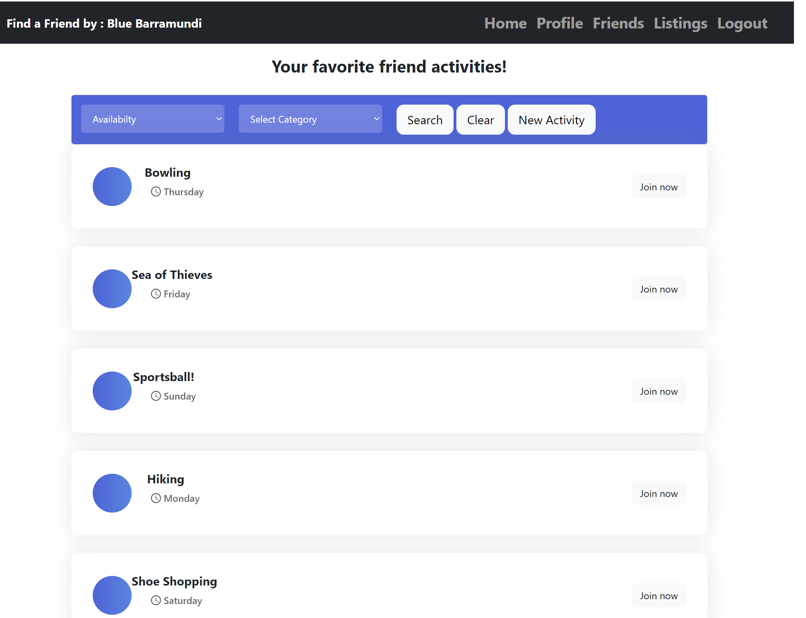
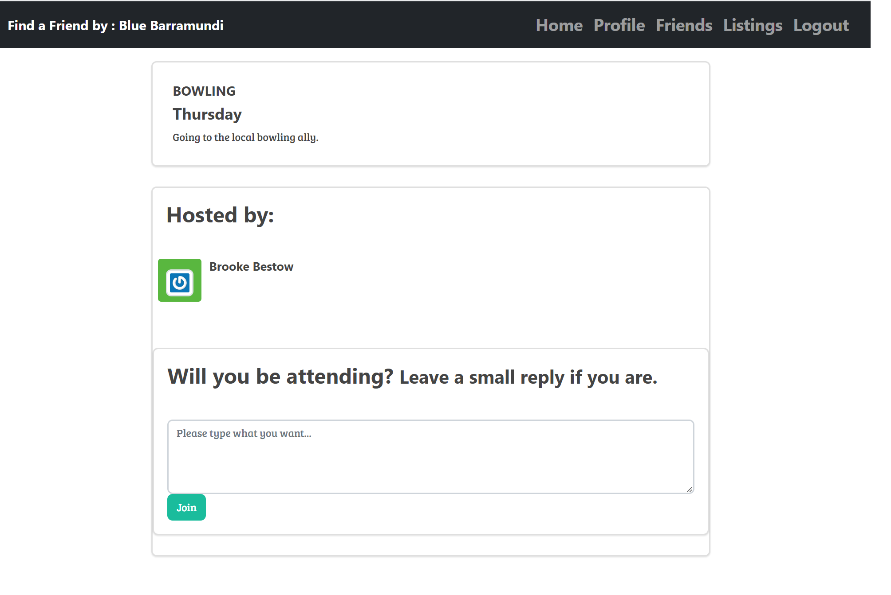
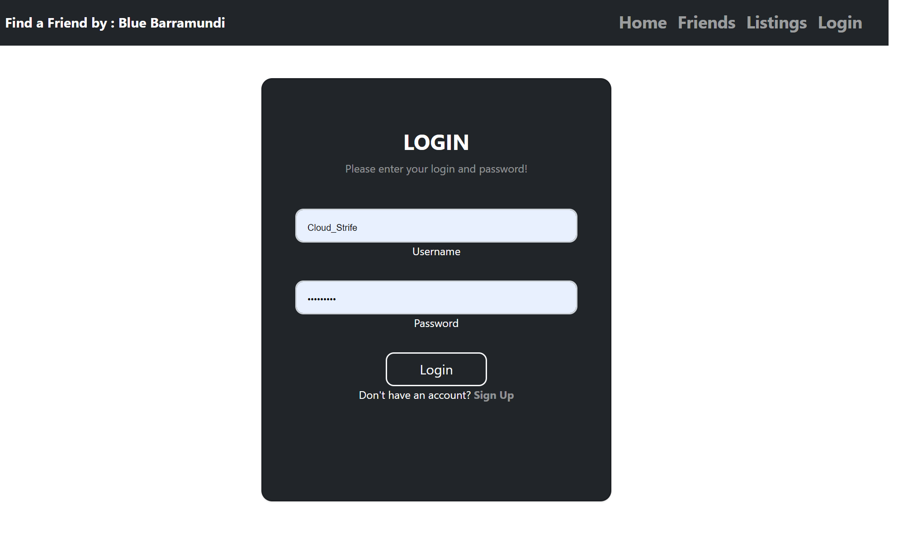
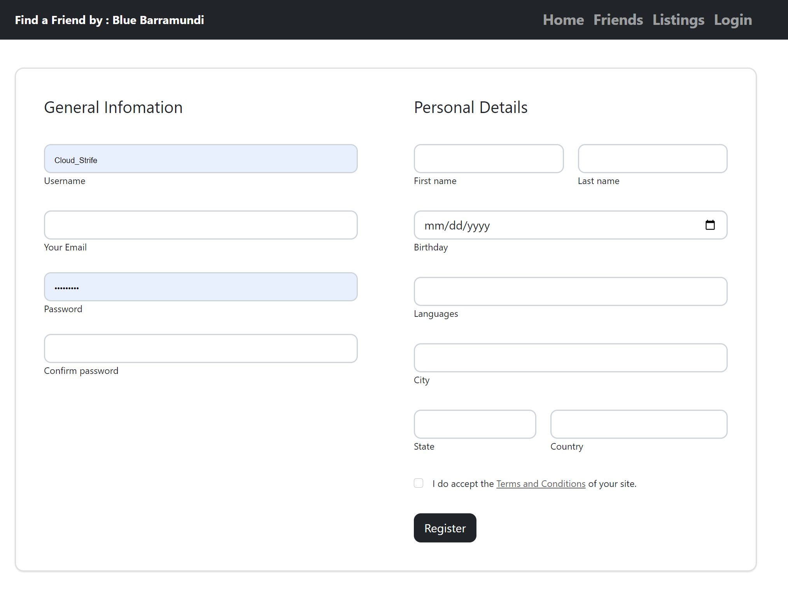

# Find a Friend

[](https://opensource.org/licenses/MIT)

## Description

The purpose of this is to create a full stack web app that allows users find other people to do activities with. It will allow users to create an account and post or find others who are looking for something to do

## User Story

```md
AS A user who is looking for something to do
I WANT a social website
SO THAT I can find other people who want to do something I am interested in
```

## Table of Contents

1. [Description](#description)
2. [Installation](#installation)
3. [Usage](#usage)
4. [Contributing](#contributing)
5. [Tests](#tests)
6. [Questions](#questions)
7. [License](#license)

## Installation

1. Download.
2. Run `npm i` in your terminal.
3. Login to your **mysql** shell and run schema.sql. Optionally, you may also `npm run seed` to seed the database.
4. Create a .env file in the root and enter the following information:

```
DB_NAME=employees_db
DB_USER=YOUR_MYSQL_USERNAME_GOES_HERE (default is root)
DB_PW=YOUR_MYSQL_PASSWORD_GOES_HERE
SECRET=YOUR_SESSION_SECRET_GOES_HERE
```

5. Enter the command `npm start`.

## Usage

[Deployed App](https://fathomless-gorge-22203.herokuapp.com/)

















## Contributors

- [@Michael Melanson](https://github.com/mmelan000)
- [@Jovy Ira Naraga](https://github.com/Jlnaraga)
- [@John Rizzuto](https://github.com/Zoot83)

## Contributing

Follow best practices for naming conventions, indentation, quality comments, etc.

## Tests

A seeds folder is included for testing purposes. Run `npm run seed` then use Insomnia to make calls to routes.

## Questions

If you have any questions, please reach out to us either on Github or by Email.

- [m.melanson000@gmail.com](mailto:m.melanson000@gmail.com)
- [ira_bonching@yahoo.com](mailto:ira_bonching@yahoo.com)
- [marshallrizzuto@gmail.com](mailto:marshallrizzuto@gmail.com)

## License

- [MIT](https://opensource.org/licenses/MIT)
